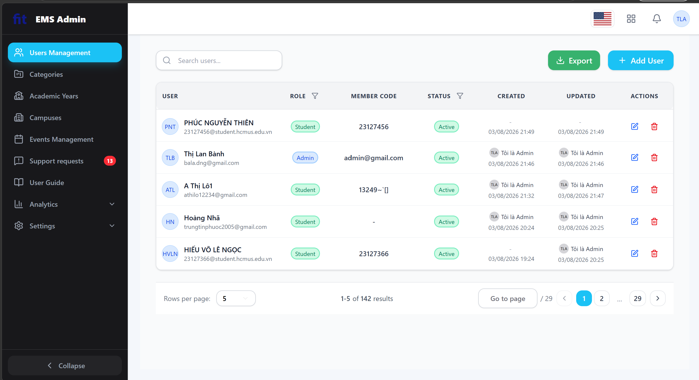
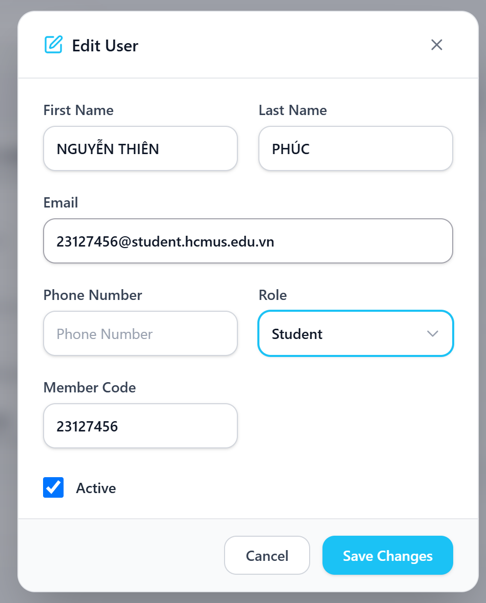
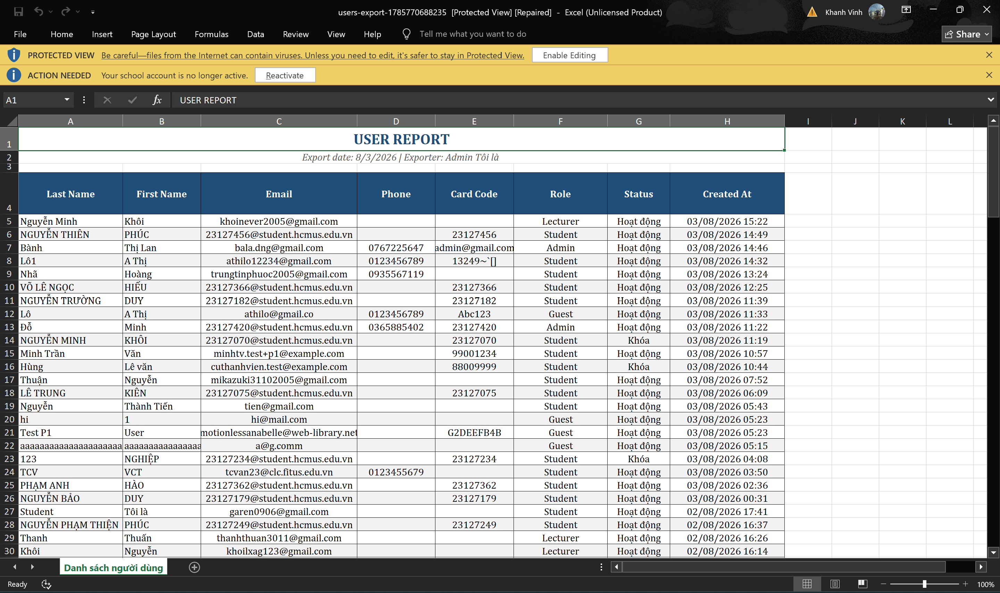

# Task 1B — Chạy Checklist (Kịch bản C — Admin quản lý người dùng)

**MSSV:** 23127522
**Kịch bản:** C — Admin quản lý người dùng
**Màn hình kiểm (≥3):** C1, C2, C4

## Chọn màn hình & lý do
| Màn hình | Tên | Lý do chọn |
| --- | --- | --- |
| C1 | Danh sách Users — search, lọc role/active, các cột (Avatar+Name, Role, Member Code, Active, Audit) | Điểm vào chính của admin; UI mật độ dữ liệu cao nhất, dùng nhiều IA-01 + IA-03. |
| C2 | Assign Role / sửa user | Hành động ghi chính có ràng buộc role; dùng nhiều IA-02 (forms) + IA-04 (feedback). |
| C4 | Export ra Excel — đầy đủ cột + phản hồi tải xuống | Dùng IA-04 (progress/feedback) và tính toàn vẹn dữ liệu cột export. |

## Cách chạy
- Đánh dấu mỗi mục **P** (Passed) / **F** (Failed) / **NA** (không áp dụng).
- Mục **F** bắt buộc ghi lý do vào cột **Note** và tham chiếu ảnh.
- Chỉ đính kèm ảnh cho các mục **Failed** (ảnh tổng thể màn hình đã có sẵn ở đầu mỗi phần).

---

## C1 — Danh sách Users

| Mã | Mục kiểm (tiếng Việt) | P/F/NA | Note (bắt buộc nếu F) |
| --- | --- | --- | --- |
| IA01-01 | Layout căn lưới nhất quán, khối canh lề đều, không lệch cột/tràn viền ở 1366px | P |  |
| IA01-02 | Khoảng cách (padding/margin) đồng nhất theo hệ spacing chung | P |  |
| IA01-03 | Typography nhất quán (cỡ chữ, weight, line-height theo cấp bậc) | P |  |
| IA01-04 | Bảng màu nhất quán, màu nhấn dùng đúng vai trò | P |  |
| IA01-05 | Tương phản chữ/nền đạt WCAG AA (4.5:1 / 3:1) | P |  |
| IA01-06 | Icon/nút cùng chức năng trông giống nhau khắp các màn hình | P |  |
| IA01-07 | Đổi ngôn ngữ EN/VI hoạt động, không lẫn ngôn ngữ hay lộ khóa dịch | P |  |
| IA01-08 | Sau khi sang VI layout không vỡ do chuỗi dài (không cắt/tràn) | P |  |
| IA01-09 | Trạng thái rỗng có thông báo + gợi ý hành động, không phải màn trắng | P |  |
| IA01-10 | Trạng thái loading có chỉ báo (skeleton/spinner) | P |  |
| IA01-11 | Ngày/số/tiền hiển thị đúng định dạng locale (dd/mm/yyyy) | P |  |
| IA01-12 | Ảnh (avatar) đúng tỉ lệ, không méo/vỡ; ảnh nội dung có alt text | P |  |
| IA01-13 | Responsive: bố cục co giãn hợp lý desktop/tablet/phone | P | Bảng cuộn ngang trên mobile nhưng xem đủ cột/chức năng; sidebar co lại + hamburger hoạt động |
| IA01-14 | Bảng dữ liệu: cột sort được, header sticky khi cuộn, nghĩa cột rõ | P |  |
| IA01-15 | Bảng xử lý dữ liệu nặng: text dài truncate/wrap, chọn nhiều dòng rõ, bảng rỗng có empty state | F | Khi nhập tên/nội dung rất dài, avatar bị bóp méo từ hình tròn thành ê-líp (thiếu flex-shrink/min-width). Text có wrap nhưng phá vỡ layout dòng. Bảng vẫn cuộn ngang được nhưng avatar hiển thị sai. |
| IA02-01 | Mỗi ô nhập có label rõ, gắn đúng input (không dùng placeholder thay label) | NA | Màn C1 là danh sách, không có form nhập liệu; test đầy đủ ở C2 |
| IA02-02 | Trường bắt buộc đánh dấu rõ (* hoặc "bắt buộc") | NA | Không có form ở C1 |
| IA02-03 | Validation đúng ràng buộc (email, số, độ dài, ngày hợp lệ) | NA | Không có form ở C1 |
| IA02-04 | Báo lỗi hiển thị sát trường lỗi, không gộp một chỗ | NA | Không có form ở C1 |
| IA02-05 | Nội dung lỗi rõ nghĩa, chỉ cách sửa, không phải mã lỗi thô | NA | Không có form ở C1 |
| IA02-06 | Validation ngày/giờ: chặn ngày bắt đầu sau ngày kết thúc, chặn quá khứ | NA | Không có trường ngày/giờ ở C1 |
| IA02-07 | Upload ảnh: kiểm định dạng/dung lượng, báo lỗi, preview khi đúng | NA | Không có upload ở C1 |
| IA02-08 | Rich-text editor hoạt động đúng (bold/list/link có hiệu lực, lưu/hiển thị đúng) | NA | Không có editor ở C1 |
| IA02-09 | Nhập liệu được giữ khi validation fail, không xóa trắng form | NA | Không có form ở C1 |
| IA02-10 | Có xác nhận/hoàn tác khi rời form dở hoặc thao tác phá dữ liệu | NA | Không có form ở C1 |
| IA02-11 | Nút submit disable/loading khi đang gửi để tránh double-submit | NA | Không có submit form ở C1 |
| IA02-12 | Điều hướng bàn phím trong form đúng thứ tự Tab, Enter submit, focus rõ | NA | Không có form ở C1 |
| IA02-13 | Công tắc cấu hình có mặc định rõ và ràng buộc hợp lệ (Max Slots > 0) | NA | Không có cấu hình ở C1 |
| IA03-01 | Menu/sidebar đủ mục, nhãn dễ hiểu, mục đang chọn highlight rõ | P |  |
| IA03-02 | Breadcrumb phản ánh đúng vị trí và điều hướng ngược được | P |  |
| IA03-03 | Tab chuyển đúng nội dung, tab active phân biệt rõ | P |  |
| IA03-04 | Nút Back/Return về đúng màn trước, không mất dữ liệu/sai ngữ cảnh | P |  |
| IA03-05 | Kéo-thả reorder mượt, có gợi ý vị trí thả, lưu đúng thứ tự | P |  |
| IA03-06 | Deep link: mở URL trực tiếp trả đúng nội dung (không ép về trang chủ) | P |  |
| IA03-07 | Điều hướng nhất quán giữa các trang (menu/header/nút không đổi chỗ) | P |  |
| IA03-08 | Có lối thoát rõ: đóng dialog, hủy thao tác, thoát luồng nhiều bước | P |  |
| IA03-09 | Nút/link có affordance rõ (trông bấm được), có hover/focus | F | Nút phân trang có `cursor: pointer`, nhưng Add User / Export / Edit / Delete KHÔNG đổi con trỏ thành bàn tay khi hover — affordance không nhất quán, thiếu `cursor: pointer` cho các nút chính |
| IA03-10 | Phân trang/cuộn danh sách đúng, giữ ngữ cảnh khi quay lại từ chi tiết | P |  |
| IA03-11 | Điều hướng bàn phím xuyên suốt menu/tab/link, focus order logic | P |  |
| IA04-01 | Sau mỗi hành động có feedback rõ (toast) báo thành công/thất bại | F | Sau khi tạo mới user thành công, hệ thống KHÔNG hiển thị toast/thông báo xác nhận — người dùng không biết thao tác đã thành công hay chưa |
| IA04-02 | Toast tồn tại đủ lâu để đọc hoặc cho đóng chủ động | NA | Không có toast nào xuất hiện nên không đánh giá được thời lượng — xem IA04-01 |
| IA04-03 | Thao tác phá hủy (Delete/Block/Reset Password) có dialog xác nhận nêu hậu quả | P |  |
| IA04-04 | Dialog xác nhận phân biệt rõ nút chính/hủy, nút nguy hiểm không mặc định | P |  |
| IA04-05 | Badge (chấm, số lượng, tab count) hiển thị đúng và cập nhật khi đổi state | P |  |
| IA04-06 | Progress bar phản ánh đúng tiến độ, không đứng hình/nhảy 0→100 | NA | Màn C1 không có progress bar |
| IA04-07 | Màu trạng thái nhất quán và có nghĩa (xanh/đỏ/vàng) | P |  |
| IA04-08 | Không chỉ dùng màu — kèm text/icon cho người mù màu | P |  |
| IA04-09 | Cập nhật real-time đúng và kịp thời, không cần F5 | P |  |
| IA04-10 | Lỗi hệ thống (mất mạng/timeout/500) hiển thị thân thiện, gợi ý bước tiếp | F | Khi mất mạng lúc bấm "Lưu thay đổi", form hiển thị lỗi thô "Failed to fetch" — không phải ngôn ngữ người dùng, không nêu lý do (mất kết nối), không có nút Thử lại |
| IA04-11 | State sau hành động phản ánh đúng dữ liệu (VD sau đổi role, list cập nhật) | P |  |

---

## C2 — Assign Role / sửa user

| Mã | Mục kiểm (tiếng Việt) | P/F/NA | Note (bắt buộc nếu F) |
| --- | --- | --- | --- |
| IA01-01 | Layout căn lưới nhất quán, khối canh lề đều, không lệch cột/tràn viền ở 1366px | P |  |
| IA01-02 | Khoảng cách (padding/margin) đồng nhất theo hệ spacing chung | P |  |
| IA01-03 | Typography nhất quán (cỡ chữ, weight, line-height theo cấp bậc) | P |  |
| IA01-04 | Bảng màu nhất quán, màu nhấn dùng đúng vai trò | P |  |
| IA01-05 | Tương phản chữ/nền đạt WCAG AA (4.5:1 / 3:1) | P |  |
| IA01-06 | Icon/nút cùng chức năng trông giống nhau khắp các màn hình | P |  |
| IA01-07 | Đổi ngôn ngữ EN/VI hoạt động, không lẫn ngôn ngữ hay lộ khóa dịch | P |  |
| IA01-08 | Sau khi sang VI layout không vỡ do chuỗi dài (không cắt/tràn) | P |  |
| IA01-09 | Trạng thái rỗng có thông báo + gợi ý hành động, không phải màn trắng | NA | Modal form không có vùng danh sách/collection để rỗng; dữ liệu đã có sẵn ở client (SPA) |
| IA01-10 | Trạng thái loading có chỉ báo (skeleton/spinner) | NA | Modal mở tức thì bằng dữ liệu đã tải sẵn (SPA), không có bước tải lại nên không có trạng thái loading |
| IA01-11 | Ngày/số/tiền hiển thị đúng định dạng locale (dd/mm/yyyy) | NA | Modal không hiển thị trường ngày/số/tiền |
| IA01-12 | Ảnh (avatar) đúng tỉ lệ, không méo/vỡ; ảnh nội dung có alt text | NA | Modal không có thẻ `` nào |
| IA01-13 | Responsive: bố cục co giãn hợp lý desktop/tablet/phone | P |  |
| IA01-14 | Bảng dữ liệu: cột sort được, header sticky khi cuộn, nghĩa cột rõ | NA | Modal form không phải data-table |
| IA01-15 | Bảng xử lý dữ liệu nặng: text dài truncate/wrap, chọn nhiều dòng rõ, bảng rỗng có empty state | F | Nhập nội dung rất dài vào field thì bị tràn, không truncate/wrap gọn. Ảnh: bugs/C02_IA01-15.png |
| IA02-01 | Mỗi ô nhập có label rõ, gắn đúng input (không dùng placeholder thay label) | P | Cả 7 field đều có label gắn đúng qua aria-label/label bao ngoài |
| IA02-02 | Trường bắt buộc đánh dấu rõ (* hoặc "bắt buộc") | F | 3 field bắt buộc (First Name, Last Name, Email) đều KHÔNG có dấu `*` hay chữ "bắt buộc"; người dùng chỉ biết thiếu gì sau khi bấm Save |
| IA02-03 | Validation đúng ràng buộc (email, số, độ dài, ngày hợp lệ) | P |  |
| IA02-04 | Báo lỗi hiển thị sát trường lỗi, không gộp một chỗ | P |  |
| IA02-05 | Nội dung lỗi rõ nghĩa, chỉ cách sửa, không phải mã lỗi thô | P |  |
| IA02-06 | Validation ngày/giờ: chặn ngày bắt đầu sau ngày kết thúc, chặn quá khứ | NA | Form sửa user không có trường ngày/giờ |
| IA02-07 | Upload ảnh: kiểm định dạng/dung lượng, báo lỗi, preview khi đúng | NA | Form sửa user không có chức năng upload ảnh |
| IA02-08 | Rich-text editor hoạt động đúng (bold/list/link có hiệu lực, lưu/hiển thị đúng) | NA | Form sửa user không có rich-text editor |
| IA02-09 | Nhập liệu được giữ khi validation fail, không xóa trắng form | P |  |
| IA02-10 | Có xác nhận/hoàn tác khi rời form dở hoặc thao tác phá dữ liệu | F | Đang nhập dở mà bấm X/backdrop thì modal đóng thẳng, mất toàn bộ dữ liệu đã nhập, không có hộp thoại xác nhận "có thay đổi chưa lưu" |
| IA02-11 | Nút submit disable/loading khi đang gửi để tránh double-submit | P |  |
| IA02-12 | Điều hướng bàn phím trong form đúng thứ tự Tab, Enter submit, focus rõ | P | Không có phần tử nào đặt tabindex dương nên thứ tự Tab theo đúng thứ tự DOM; nhấn Enter trong ô text submit đúng (lưu thay đổi), không đóng modal ngoài ý muốn |
| IA02-13 | Công tắc cấu hình có mặc định rõ và ràng buộc hợp lệ (Max Slots > 0) | P | Chỉ có công tắc Active, mặc định rõ (tick = đang hoạt động); không có trường số kiểu Max Slots nên không có ràng buộc để vi phạm |
| IA03-01 | Menu/sidebar đủ mục, nhãn dễ hiểu, mục đang chọn highlight rõ | NA | Modal không có sidebar; điều hướng đã test ở màn cha C1 |
| IA03-02 | Breadcrumb phản ánh đúng vị trí và điều hướng ngược được | NA | Modal không đổi route nên không có breadcrumb riêng |
| IA03-03 | Tab chuyển đúng nội dung, tab active phân biệt rõ | NA | Modal không có tab (dropdown Role là select, không phải tab) |
| IA03-04 | Nút Back/Return về đúng màn trước, không mất dữ liệu/sai ngữ cảnh | NA | Modal dùng nút đóng thay cho Back — xem IA03-08 và IA02-10 |
| IA03-05 | Kéo-thả reorder mượt, có gợi ý vị trí thả, lưu đúng thứ tự | NA | Modal form không có chức năng kéo-thả sắp xếp |
| IA03-06 | Deep link: mở URL trực tiếp trả đúng nội dung (không ép về trang chủ) | NA | Modal mở mà URL không đổi (vẫn /dashboard/admin/users) nên không có URL riêng để deep link |
| IA03-07 | Điều hướng nhất quán giữa các trang (menu/header/nút không đổi chỗ) | NA | Modal không đổi route, không có menu/header riêng |
| IA03-08 | Có lối thoát rõ: đóng dialog, hủy thao tác, thoát luồng nhiều bước | P | Có 2 lối thoát (nút X và Cancel) hoạt động được |
| IA03-09 | Nút/link có affordance rõ (trông bấm được), có hover/focus | F | 3/4 phần tử bấm được thiếu `cursor: pointer` (Close, Cancel, Save Changes); chỉ dropdown Role có pointer — lặp lại đúng lỗi ở C1 nên là lỗi hệ thống toàn app |
| IA03-10 | Phân trang/cuộn danh sách đúng, giữ ngữ cảnh khi quay lại từ chi tiết | NA | Modal không có phân trang |
| IA03-11 | Điều hướng bàn phím xuyên suốt menu/tab/link, focus order logic | F | Modal thiếu focus trap: Tab qua nút cuối ("Lưu thay đổi") thì focus nhảy ra sidebar phía sau thay vì quay về đầu modal; nền sau không được che bằng `inert`/`aria-hidden` (37 phần tử focus được vẫn phơi bày) — xem finding 010 |
| IA04-01 | Sau mỗi hành động có feedback rõ (toast) báo thành công/thất bại | F | Bấm "Lưu thay đổi" xong modal đóng nhưng KHÔNG có toast/thông báo nào báo thành công hay thất bại — lỗi giống C1, xem finding 003 |
| IA04-02 | Toast tồn tại đủ lâu để đọc hoặc cho đóng chủ động | NA | Không có toast nào xuất hiện nên không đánh giá được thời lượng — xem IA04-01 |
| IA04-03 | Thao tác phá hủy (Delete/Block/Reset Password) có dialog xác nhận nêu hậu quả | NA | Modal sửa user không có thao tác phá hủy (chỉ Save/Cancel); Delete/Block thuộc màn C1 |
| IA04-04 | Dialog xác nhận phân biệt rõ nút chính/hủy, nút nguy hiểm không mặc định | NA | Modal này không phải dialog xác nhận thao tác phá hủy — xem IA04-03 |
| IA04-05 | Badge (chấm, số lượng, tab count) hiển thị đúng và cập nhật khi đổi state | NA | Modal không có badge nào |
| IA04-06 | Progress bar phản ánh đúng tiến độ, không đứng hình/nhảy 0→100 | NA | Modal không có progress bar |
| IA04-07 | Màu trạng thái nhất quán và có nghĩa (xanh/đỏ/vàng) | P | Màu trạng thái nhất quán với màn C1, cùng một nghĩa (xanh = Active, xám = Inactive) |
| IA04-08 | Không chỉ dùng màu — kèm text/icon cho người mù màu | P | Trạng thái luôn kèm nhãn chữ (Active/Inactive) chứ không chỉ dựa vào màu |
| IA04-09 | Cập nhật real-time đúng và kịp thời, không cần F5 | P | Sau khi lưu, danh sách/hàng user cập nhật ngay, không cần F5 |
| IA04-10 | Lỗi hệ thống (mất mạng/timeout/500) hiển thị thân thiện, gợi ý bước tiếp | F | Mất mạng lúc bấm "Lưu thay đổi" thì form hiện lỗi thô "Failed to fetch" — không phải ngôn ngữ người dùng, không nêu lý do mất kết nối, không có nút Thử lại. Ảnh: bugs/C01_IA04-10.png |
| IA04-11 | State sau hành động phản ánh đúng dữ liệu (VD sau đổi role, list cập nhật) | P | Sau khi đổi role/thông tin và lưu, hàng trong bảng hiển thị đúng dữ liệu mới |

---

## C4 — Export ra Excel

**Phạm vi C4**: C4 không phải một màn hình riêng mà là **luồng hành động Export** nằm trên trang Users. Phạm vi gồm: (a) nút Export và trạng thái của nó, (b) phản hồi UI trong và sau khi export, (c) tính khớp giữa nội dung file `.xlsx` và dữ liệu đang hiển thị trên màn hình. Các mục về layout/điều hướng chung của trang Users **đã đánh giá ở C1** nên ghi NA với lý do phạm vi, tránh chấm trùng và tránh sao chép verdict của C1 sang C4.

**Hành vi quan sát được**: bấm Export là tải file xuống ngay — không có dialog cấu hình, không có toast, không có progress bar.

| Mã | Mục kiểm (tiếng Việt) | P/F/NA | Note (bắt buộc nếu F) |
| --- | --- | --- | --- |
| IA01-01 | Layout căn lưới nhất quán, khối canh lề đều, không lệch cột/tràn viền ở 1366px | NA | Layout trang Users đã đánh giá ở C1; luồng Export chỉ có 1 nút, không có layout riêng |
| IA01-02 | Khoảng cách (padding/margin) đồng nhất theo hệ spacing chung | NA | Đã đánh giá ở C1 — ngoài phạm vi luồng Export |
| IA01-03 | Typography nhất quán (cỡ chữ, weight, line-height theo cấp bậc) | NA | Đã đánh giá ở C1 — ngoài phạm vi luồng Export |
| IA01-04 | Bảng màu nhất quán, màu nhấn dùng đúng vai trò | NA | Đã đánh giá ở C1 — ngoài phạm vi luồng Export |
| IA01-05 | Tương phản chữ/nền đạt WCAG AA (4.5:1 / 3:1) | NA | Đã đánh giá ở C1 — ngoài phạm vi luồng Export |
| IA01-06 | Icon/nút cùng chức năng trông giống nhau khắp các màn hình | NA | Nút Export chỉ xuất hiện ở màn Users, không có màn thứ hai để đối chiếu tính nhất quán |
| IA01-07 | Đổi ngôn ngữ EN/VI hoạt động, không lẫn ngôn ngữ hay lộ khóa dịch | P | Tiêu đề cột trong file `.xlsx` là chữ người đọc được, không lộ khóa dịch thô (kiểu `users.table.email`); tiếng Việt có dấu đọc được, không bị mojibake — encoding UTF-8 đúng |
| IA01-08 | Sau khi sang VI layout không vỡ do chuỗi dài (không cắt/tràn) | NA | Đã đánh giá ở C1 — file Excel không có layout co giãn theo ngôn ngữ |
| IA01-09 | Trạng thái rỗng có thông báo + gợi ý hành động, không phải màn trắng |  |  |
| IA01-10 | Trạng thái loading có chỉ báo (skeleton/spinner) |  |  |
| IA01-11 | Ngày/số/tiền hiển thị đúng định dạng locale (dd/mm/yyyy) | P | Ngày trong file khớp định dạng đang hiển thị trên UI, không bị đảo tháng/ngày kiểu mm/dd |
| IA01-12 | Ảnh (avatar) đúng tỉ lệ, không méo/vỡ; ảnh nội dung có alt text | NA | File Excel không chứa ảnh; avatar trên bảng đã đánh giá ở C1 |
| IA01-13 | Responsive: bố cục co giãn hợp lý desktop/tablet/phone | NA | Đã đánh giá ở C1 — file Excel không có responsive |
| IA01-14 | Bảng dữ liệu: cột sort được, header sticky khi cuộn, nghĩa cột rõ | NA | Bảng trên web đã đánh giá ở C1; sort/sticky là tính năng của Excel, không phải của app |
| IA01-15 | Bảng xử lý dữ liệu nặng: text dài truncate/wrap, chọn nhiều dòng rõ, bảng rỗng có empty state | NA | Đã đánh giá ở C1 — ngoài phạm vi luồng Export |
| IA02-01 | Mỗi ô nhập có label rõ, gắn đúng input (không dùng placeholder thay label) | NA | Luồng Export không có form nhập liệu — bấm là tải ngay, không có dialog cấu hình |
| IA02-02 | Trường bắt buộc đánh dấu rõ (* hoặc "bắt buộc") | NA | Luồng Export không có form nhập liệu |
| IA02-03 | Validation đúng ràng buộc (email, số, độ dài, ngày hợp lệ) | NA | Luồng Export không có form nhập liệu |
| IA02-04 | Báo lỗi hiển thị sát trường lỗi, không gộp một chỗ | NA | Luồng Export không có form nhập liệu |
| IA02-05 | Nội dung lỗi rõ nghĩa, chỉ cách sửa, không phải mã lỗi thô | NA | Luồng Export không có form nhập liệu |
| IA02-06 | Validation ngày/giờ: chặn ngày bắt đầu sau ngày kết thúc, chặn quá khứ | NA | Không có dialog chọn khoảng thời gian để export |
| IA02-07 | Upload ảnh: kiểm định dạng/dung lượng, báo lỗi, preview khi đúng | NA | Luồng Export là tải xuống, không có upload |
| IA02-08 | Rich-text editor hoạt động đúng (bold/list/link có hiệu lực, lưu/hiển thị đúng) | NA | Luồng Export không có rich-text editor |
| IA02-09 | Nhập liệu được giữ khi validation fail, không xóa trắng form | NA | Luồng Export không có form nhập liệu |
| IA02-10 | Có xác nhận/hoàn tác khi rời form dở hoặc thao tác phá dữ liệu | NA | Export chỉ đọc dữ liệu, không phá dữ liệu; không có form dở để mất |
| IA02-11 | Nút submit disable/loading khi đang gửi để tránh double-submit |  |  |
| IA02-12 | Điều hướng bàn phím trong form đúng thứ tự Tab, Enter submit, focus rõ | NA | Không có form; điều hướng bàn phím của trang đã đánh giá ở C1 |
| IA02-13 | Công tắc cấu hình có mặc định rõ và ràng buộc hợp lệ (Max Slots > 0) | NA | Luồng Export không có công tắc cấu hình nào |
| IA03-01 | Menu/sidebar đủ mục, nhãn dễ hiểu, mục đang chọn highlight rõ | NA | Đã đánh giá ở C1 — Export không đổi route nên không ảnh hưởng sidebar |
| IA03-02 | Breadcrumb phản ánh đúng vị trí và điều hướng ngược được | NA | App không dùng breadcrumb; Export không đổi route |
| IA03-03 | Tab chuyển đúng nội dung, tab active phân biệt rõ | NA | Luồng Export không có tab |
| IA03-04 | Nút Back/Return về đúng màn trước, không mất dữ liệu/sai ngữ cảnh | NA | Export không rời màn hình nên không có thao tác Back |
| IA03-05 | Kéo-thả reorder mượt, có gợi ý vị trí thả, lưu đúng thứ tự | NA | Luồng Export không có kéo-thả |
| IA03-06 | Deep link: mở URL trực tiếp trả đúng nội dung (không ép về trang chủ) | NA | Export không có URL riêng (không đổi route khi bấm) |
| IA03-07 | Điều hướng nhất quán giữa các trang (menu/header/nút không đổi chỗ) | NA | Đã đánh giá ở C1 — Export không đổi trang |
| IA03-08 | Có lối thoát rõ: đóng dialog, hủy thao tác, thoát luồng nhiều bước |  |  |
| IA03-09 | Nút/link có affordance rõ (trông bấm được), có hover/focus |  |  |
| IA03-10 | Phân trang/cuộn danh sách đúng, giữ ngữ cảnh khi quay lại từ chi tiết | NA | Đã đánh giá ở C1 — Export không có phân trang riêng |
| IA03-11 | Điều hướng bàn phím xuyên suốt menu/tab/link, focus order logic |  |  |
| IA04-01 | Sau mỗi hành động có feedback rõ (toast) báo thành công/thất bại | F | Bấm Export xong file tải xuống nhưng KHÔNG có toast/thông báo nào báo đã xuất thành công — người dùng chỉ biết nhờ thanh download của trình duyệt, không phải phản hồi của app. Lỗi lặp lại ở cả 3 màn C1/C2/C4 |
| IA04-02 | Toast tồn tại đủ lâu để đọc hoặc cho đóng chủ động | NA | Không có toast nào xuất hiện nên không đánh giá được thời lượng — xem IA04-01 |
| IA04-03 | Thao tác phá hủy (Delete/Block/Reset Password) có dialog xác nhận nêu hậu quả | NA | Export là thao tác chỉ-đọc, không phá hủy dữ liệu; Delete user thuộc phạm vi C1 |
| IA04-04 | Dialog xác nhận phân biệt rõ nút chính/hủy, nút nguy hiểm không mặc định | NA | Luồng Export không có dialog xác nhận — xem IA04-03 |
| IA04-05 | Badge (chấm, số lượng, tab count) hiển thị đúng và cập nhật khi đổi state | NA | Luồng Export không có badge/counter nào (script xác nhận 0 badge trong phạm vi) |
| IA04-06 | Progress bar phản ánh đúng tiến độ, không đứng hình/nhảy 0→100 | NA | Không có progress bar nào trong luồng Export (script xác nhận 0 progress bar); file tải xuống ngay nên không có tiến độ để hiển thị |
| IA04-07 | Màu trạng thái nhất quán và có nghĩa (xanh/đỏ/vàng) | P | Nhãn trạng thái "Active" dùng đúng một tổ hợp màu chữ/nền trên toàn phạm vi, nhất quán với C1/C2 |
| IA04-08 | Không chỉ dùng màu — kèm text/icon cho người mù màu | P | Mọi chỉ báo trạng thái đều kèm nhãn chữ, không có chấm màu trần nào thiếu chữ/`aria-label` |
| IA04-09 | Cập nhật real-time đúng và kịp thời, không cần F5 | NA | Export không thay đổi dữ liệu nên không có state nào cần cập nhật real-time |
| IA04-10 | Lỗi hệ thống (mất mạng/timeout/500) hiển thị thân thiện, gợi ý bước tiếp | F | Bật Network → Offline rồi bấm Export: app KHÔNG xuất file và cũng KHÔNG hiện bất kỳ thông báo lỗi nào — thất bại im lặng, người dùng không biết export đã lỗi hay đang chạy, không có gợi ý thử lại |
| IA04-11 | State sau hành động phản ánh đúng dữ liệu (VD sau đổi role, list cập nhật) | P | Mở file `.xlsx` đối chiếu với bảng trên màn hình: tập dữ liệu xuất ra khớp với dữ liệu đang hiển thị/lọc — đủ user, đúng giá trị các cột |

---

## Tổng hợp
| Màn hình | Số mục chạy | Passed | Failed | N/A |
| --- | --- | --- | --- | --- |
| C1 | 50 | 31 | 4 | 15 |
| C2 | 50 | 22 | 7 | 21 |
| C4 | 44 | 5 | 2 | 37 |
| **Tổng** | **144** | **58** | **13** | **73** |

> C4 còn **6 mục chưa quan sát** (IA01-09, IA01-10, IA02-11, IA03-08, IA03-09, IA03-11) nên chưa tính vào "Số mục chạy" — để trống theo §12, không đoán verdict.

> **Lưu ý (§12):** Cột P/F/Note phải do chính bạn điền sau khi retest live trên EMS — đây là bằng chứng thực thi, TA xác minh. Với mỗi mục Failed, đính kèm ảnh chụp trạng thái lỗi (ngoài ảnh tổng thể ở đầu mỗi phần).

