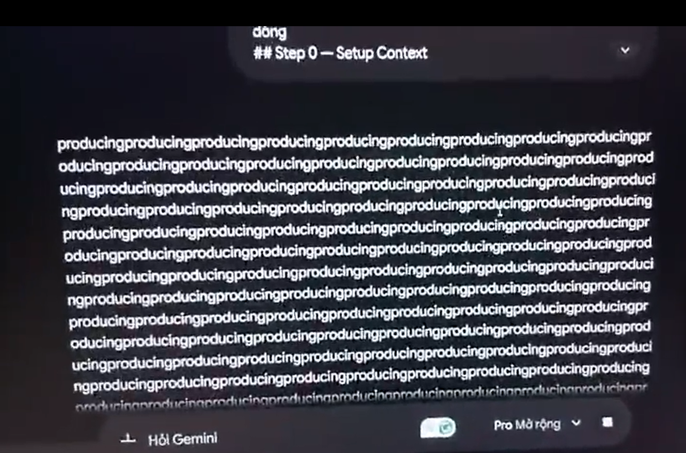

# Faculty of Information Technology – Ho Chi Minh City University of Science

# CS423 / CSC15003 – Software Testing (AI-augmented · 2026)

# AI Critique

The AI lacks independent reasoning when given prompts with incomplete context. During browser-based GUI testing with an Agent Skill, the interface included a horizontal scroll bar, but the AI did not use it to inspect a partially hidden column. It assumed the truncated value was the final state rather than exploring further.

The agent often performs unnecessary or unclear steps even when the skill specification is explicit. I also observed the AI becoming unresponsive, as shown in the screenshot while using Google Gemini to improve and fine-tune the Agent Skill.

Since the AI relies on pretrained knowledge rather than actual user behavior, it misses real user experience and UX context. For example, the Agent Skill failed to detect that the data sorting feature was missing, which is a critical requirement for administrators and management workflows.

The AI Agent Skill also took prohibited actions despite clear restrictions in `SKILL.md`. One example is automatically submitting a Google Form before receiving user approval, which violates the expected control flow.

Finally, the AI cannot complete certain automation tasks with Playwright, such as uploading files to Google Forms and interacting with Windows file system dialogs. The agent cannot see those dialogs through screenshots, so it cannot handle the full user journey reliably.

## Signature

| Student name: | LÊ ĐỨC NGỌC BẢO |
| --- | --- |
| Student ID: | 23127155 |
| Class / Cohort: | Software Testing - 23KTPM1 |
| Course: | CS423 / CSC13003 – Software Testing |
| Instructor: | [Lâm Quang Vũ](https://courses.ctda.hcmus.edu.vn/user/view.php?id=586&course=1) |
| Date: | Wednesday, August 05th, 2026 |
| Signature: |  |