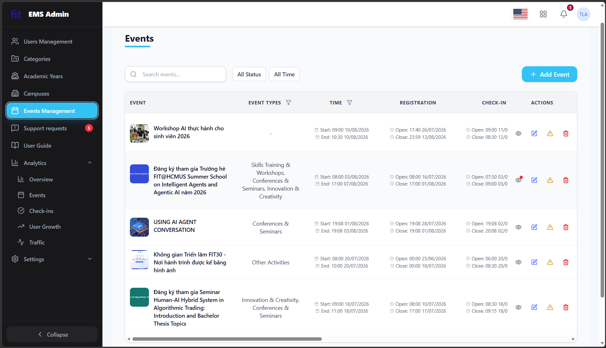
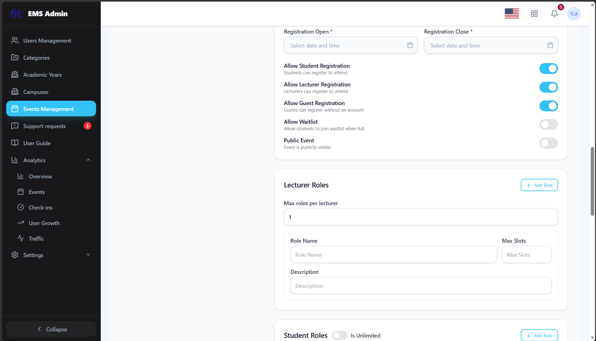
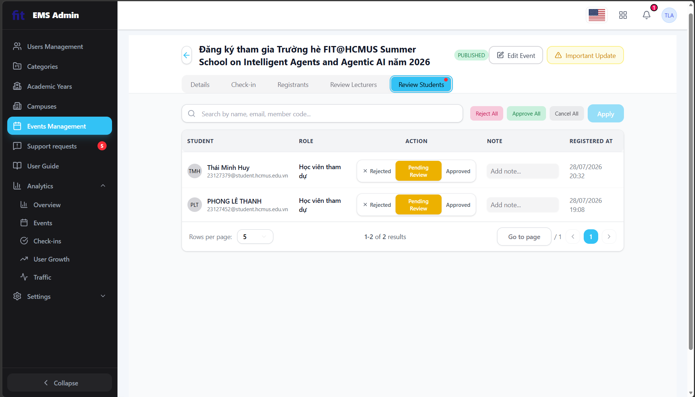

# REPORT

## Task 1 — GUI Checklist

**Scenario A** — **Admin creates and manages events**. Function group: the event lifecycle on 
the admin side.

- (A1) Events list with status filters and notification dots.

    

- (A3) Registration & Roles configuration panel — Max Slots / Waitlist / additional role.

    

- (A4) Review Students approval — status colours.

    

### Why AI Missed These Checklist Items

The following items were added to the shared checklist after being discovered through manual human inspection, because the AI model failed to flag them during its automated review. The root causes are explained below.

---

#### 3.15 — Filter controls scattered in column headers (not consolidated)

**Principle mapping:**
- **Nielsen #6 (Recognition rather than recall):** Users must be able to see all available filter options without scrolling; forcing users to scroll horizontally to discover hidden filters increases cognitive load.
- **Norman — Discoverability:** Controls must be visible and their affordance immediately clear. Filter buttons embedded beyond the viewport boundary are invisible by default.
- **Shneiderman Golden Rule #4 (Design dialogs to yield closure):** Grouping all filter controls together allows users to understand the complete set of available filters and act on them efficiently.

**IA dimension: IA-03 Navigation & Layout** — Filter access is a navigation/wayfinding concern: it determines how users move through a dataset to reach the records they need.

**Why AI missed it:**
The AI inspection prompt focused on evaluating individual, visible-on-load UI elements. It did not include an explicit instruction to *audit the holistic discoverability of all filter controls as a group*. The EMS Events Management table has an unusually wide column structure (14+ columns) that extends far beyond the default viewport — a characteristic specific to this interface that screenshot-based static analysis would miss. The AI evaluated only what was visible in each captured frame and did not reason about what interactive controls might be hidden off-screen. AI agents tend to overlook features that require multi-step scroll exploration to discover.

---

#### 3.16 — No column sorting in the data table

**Principle mapping:**
- **Nielsen #7 (Flexibility and efficiency of use):** Power users rely on sorting to quickly locate records without paging through all results.
- **Shneiderman Golden Rule #6 (Permit easy reversal of actions):** Toggling sort direction (ascending ↔ descending) must be predictable and immediately reversible via a second click.
- **Norman — Feedback:** No visual affordance (sort arrows, cursor change) on column headers means users cannot even *discover* that sorting is unavailable, leaving them no recourse.

**IA dimension: IA-03 Navigation & Layout** — Column sorting is a data-navigation mechanism that organises the user's view of information, functionally equivalent to pagination and filtering in how it helps users find specific records.

**Why AI missed it:**
Column sorting is a *missing feature* — there are no broken elements, error states, or visual anomalies to trigger detection. AI models performing visual screenshot analysis default to checking what **is present** rather than auditing for **absent-but-expected interactive affordances**. Sorting was also not listed in the original 59-item shared checklist, so the model received no explicit prompt signal to look for it. This reflects a characteristic blind spot: AI tends to overlook interactions that should exist but don't (sorting, drag-to-reorder, keyboard shortcuts, right-click context menus) unless the evaluation prompt explicitly enumerates them.

## Task 2 — User Testing with 5 Real Users

## Task 3 — Cross-Browser / Cross-Platform

| ID | Device Type | OS | Browser | Result | Notes | Screenshot |
| :---: | :---: | :---: | :---: | :--- | :--- | :---: |
| **C1** | Desktop | Windows 11 | Google Chrome | | | |
| **C2** | Desktop | macOS | Safari | | | |
| **C3** | Desktop | Windows 10 | Microsoft Edge | | | |
| **C4** | Tablet | iOS (iPadOS) | Firefox | | | |
| **C5** | Phone | Android | Samsung Internet | | | |

## Why this skill exists
Task 1B requires marking **every** item of a >40-item shared checklist as Passed/Failed
for **each** of ≥3 screens. Re-printing the full checklist (with reasoning) every time
is expensive and repetitive. This skill evaluates every item internally but only
**emits the FAILs** as a small JSON diff; a script then merges that diff onto a full
checklist template so nothing required by the grading rubric is lost.

Two optimizations are combined here — they are complementary, not alternatives:
- **Output-side (diff-only JSON):** cuts what the model has to *write* — this is the
  80–90% token saving, and it's fully under this skill's control.
- **Input-side (structural context):** the checklist text itself is parsed into
  `checklist_master.json` **once** and referenced by ID afterward, instead of being
  re-pasted into every prompt. Note: this is *not* the same thing as Anthropic API
  prompt caching (`cache_control` breakpoints) — that's a server-side API feature you
  cannot invoke from inside a chat/agent tool like Copilot. What you *can* control from
  here is simply "don't re-send text you already have on disk," which gets you most of
  the same benefit for free.

## REFERENCE

https://usabilitygeek.com/how-to-use-the-system-usability-scale-sus-to-evaluate-the-usability-of-your-website/

https://blog.uxtweak.com/user-experience-questionnaire/