# Bug and Usability Findings Log

| ID | Screen | Type | Description | Reproduction Steps / Heuristic | Severity | Suggested Fix | Evidence Image | Logged At |
| :--- | :--- | :--- | :--- | :--- | :---: | :--- | :---: | :--- |
| BUG-ScreenA1-2.09 | ScreenA1 | Bug | The search input inside the EVENT TYPES column filter dropdown displays **"Search events..."** as its placeholder — identical to the main page search bar. This is contextually wrong and misleading: users are filtering by event category, not searching for events. The placeholder gives no hint that users should type a category name (e.g., "Conferences & Seminars"). This is a copy-paste error that violates Nielsen #4 (Consistency and Standards) and degrades filter discoverability. | 1. Login as admin. 2. Navigate to Events Management. 3. Click the funnel (▽) icon next to the **EVENT TYPES** column header. 4. Observe the search box inside the dropdown — it shows **"Search events..."** instead of a relevant label like "Search event types..." or "Filter by category...". | Low | Change the placeholder of the filter search input from "Search events..." to a contextually correct label, e.g. `placeholder="Search event types..."`. Apply the same fix to any other column filter search boxes (TIME, PUBLIC, ACADEMIC CONTEXT, CAMPUS, LECTURERS, STUDENTS) to ensure each uses a relevant placeholder. | 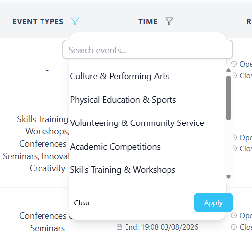 | 2026-07-31 |
| BUG-ScreenA1-3.03 | ScreenA1 | Usability | No breadcrumb navigation is present on the Events Management page. The page only displays the heading "Events" without a clickable hierarchy trail (e.g., "Dashboard > Events Management"). Users cannot determine their location in the application hierarchy or quickly navigate to a parent page. | 1. Login as admin. 2. Navigate to Events Management. 3. Observe the top content area — only the heading "Events" is visible; no breadcrumb trail exists. | Low | Add a breadcrumb component below the main header (e.g., "Home > Events Management") with clickable links to each ancestor page, consistent with the breadcrumb pattern used on other pages (Nielsen #6: Recognition rather than recall). | 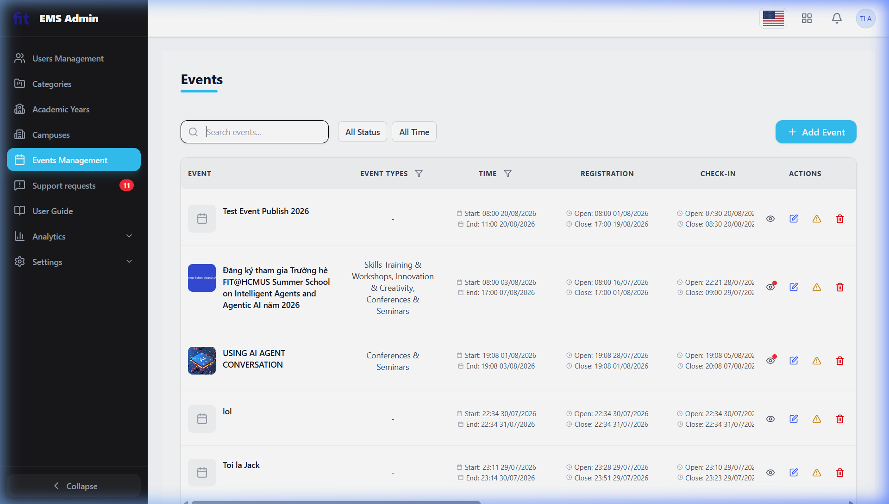 | 2026-07-31 |
| BUG-ScreenA1-4.02 | ScreenA1 | Usability | The keyboard Tab focus ring on interactive elements (e.g., the "All Status" and "All Time" filter buttons, search input) is extremely faint — only a thin, low-contrast border is visible. The focus indicator does not meet WCAG 2.1 SC 2.4.11 (Focus Appearance) minimum requirements, making keyboard-only navigation and assistive technology use significantly harder for users with low vision. | 1. Login as admin. 2. Navigate to Events Management. 3. Press the Tab key to cycle through focusable elements. 4. Observe — the focus indicator on buttons such as "All Status" and "All Time" is a barely-visible thin border, not a distinct high-contrast focus ring. | Medium | Apply a prominent focus ring style: `outline: 2px solid #0078d4; outline-offset: 2px;` (or the brand primary colour) to all interactive elements via a global `:focus-visible` CSS rule, ensuring the ring has at least a 3:1 contrast ratio against the adjacent background per WCAG 2.1 SC 2.4.11. | 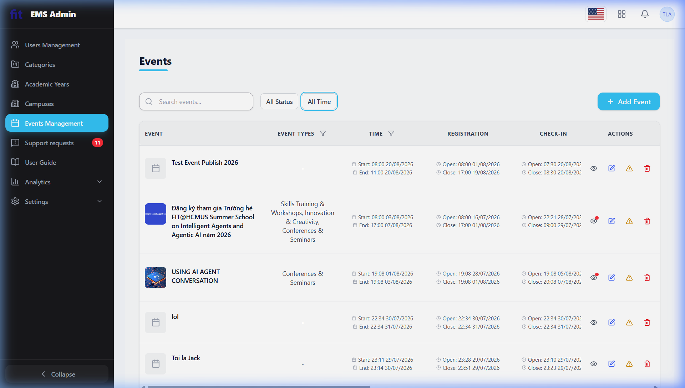 | 2026-07-31 |
| BUG-ScreenA1-4.07 | ScreenA1 | Usability | When a search query returns no matching events (e.g., typing "xyzzznonexistentquery999"), the table body is completely blank — no empty-state illustration, no explanatory message (e.g., "No events found matching your search"), and no Call to Action (e.g., "Clear search" or "+ Add Event"). Users are left staring at an empty white table with no guidance on what happened or what to do next (Nielsen #9: Help users recognise, diagnose, and recover from errors). | 1. Login as admin. 2. Navigate to Events Management. 3. Type any string that returns no results (e.g., "xyzzznonexistentquery999") in the search box. 4. Observe — the table body is fully blank; no empty-state message, graphic, or action button is shown. | Medium | Implement an empty-state component that is displayed when the result set is empty. It should include: (1) a relevant illustration or icon, (2) a short message like "No events found", and (3) a CTA button such as "Clear search" or "+ Add Event" to guide the user forward. | 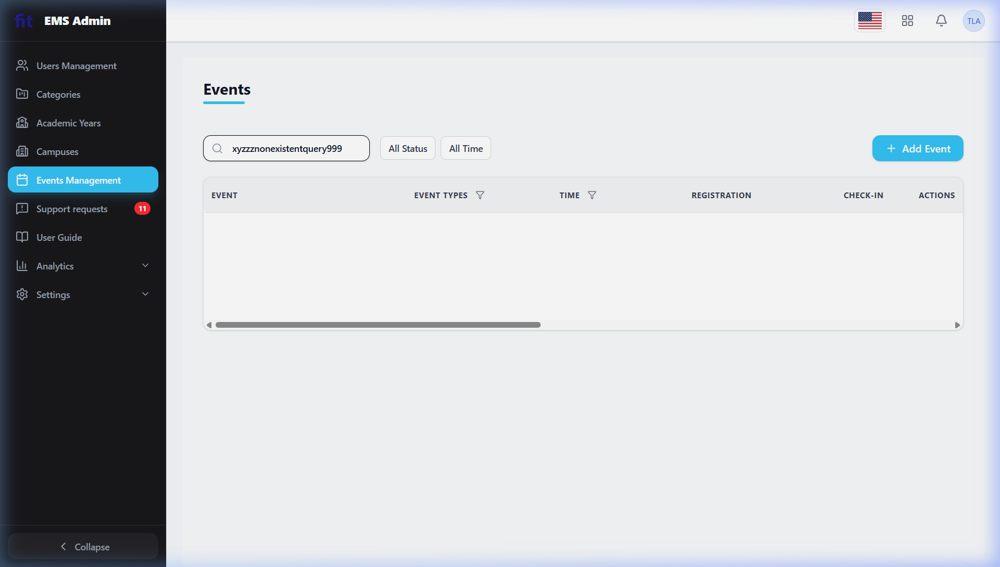 | 2026-07-31 |
| BUG-ScreenA1-3.15 | ScreenA1 | Usability | Filter controls in the Events Management table are embedded inline inside individual column headers (EVENT TYPES, TIME, PUBLIC, ACADEMIC CONTEXT, CAMPUS, LECTURERS, STUDENTS) rather than being grouped in a visible filter panel above the table. Because the table has 14+ columns and extends beyond the viewport width, most filter buttons are only discoverable after horizontal scrolling. Users who do not scroll will be unaware that ACADEMIC CONTEXT, CAMPUS, LECTURERS, and STUDENTS filters exist, creating a severe discoverability gap. | 1. Login as admin. 2. Navigate to Events Management. 3. Look at the visible toolbar area (search bar, "All Status", "All Time" buttons) — only 2 filters are immediately visible. 4. Scroll the table horizontally to the right — discover that 5+ additional filter icons (PUBLIC, ACADEMIC CONTEXT, CAMPUS, LECTURERS, STUDENTS) are hidden in column headers beyond the initial viewport. 5. Observe — there is no consolidated filter panel that shows all filter options at once. | Medium | Move all column filter controls into a dedicated, always-visible filter bar/panel positioned above the table (similar to the existing "All Status" / "All Time" buttons pattern). Each filter should be labelled and visible without any scrolling required. Alternatively, add a "Filters" button that opens a drawer or modal showing all available filter dimensions. (Nielsen #6: Recognition rather than recall). | 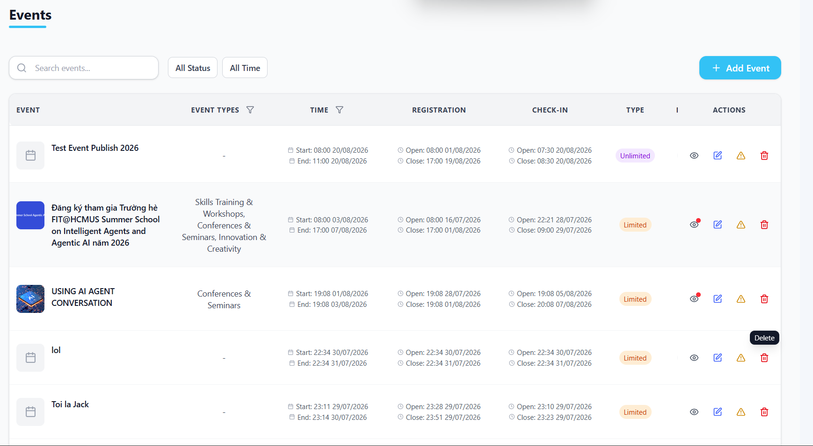 | 2026-07-31 |
| BUG-ScreenA1-3.16 | ScreenA1 | Usability | The Events Management data table provides no column sorting capability. Column headers (EVENT, EVENT TYPES, TIME, STATUS, LECTURERS, STUDENTS, CREATED, etc.) have no sort arrows, no hover affordance, and clicking them produces no response. Users cannot sort events by name, date, status, number of attendees, or any other dimension — they must scroll through all 6 pages of 28 records to locate a specific event. | 1. Login as admin. 2. Navigate to Events Management. 3. Hover over any column header (e.g., "EVENT", "TIME", "STATUS") — observe no cursor change, no sort arrow appears. 4. Click on a column header — observe no sort action is performed and the order of rows does not change. | Medium | Add click-to-sort functionality to key columns (at minimum: EVENT name, Start Time, Status, Created date). Display ▲/▼ directional arrows on hoverable column headers; show the active sort column and direction with a highlighted arrow. Persist the sort state across pagination. (Nielsen #7: Flexibility and efficiency of use; Shneiderman: Support internal locus of control). | 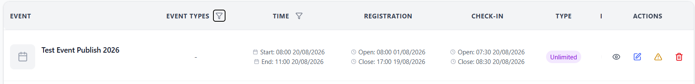 | 2026-07-31 |
| BUG-ScreenA4-1.04 | ScreenA4 | Bug | The "Apply (1)" filter button in the Review Lecturers/Students tab displays the label text and count badge without proper vertical alignment; the spacing between "Apply" and the "(1)" counter is insufficient, making the button appear unpolished and inconsistent with the design system. | 1. Login as admin. 2. Navigate to Events Management. 3. Click the view icon on any event. 4. Go to the "Review Lecturers" or "Review Students" tab. 5. Observe the blue "Apply (1)" button — the text and count are not vertically centred and are too close together. | Low | Apply `display: flex; align-items: center; justify-content: center; gap: 6px;` to the button; replace the inline `(1)` counter with a dedicated badge/pill component with proper `margin-left`. | 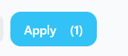 | 2026-07-30 |
| BUG-ScreenA4-1.10 | ScreenA4 | Bug | When an event has a very long title (e.g. "Thông tin chương trình tài trợ câu lạc bộ tài năng nghiên cứu khoa học của Quỹ Đổi mới sáng tạo Vingroup VINIF"), the title container does not truncate or wrap gracefully, causing the "PUBLISHED" status badge to collide directly with the "Edit Event" button with no spacing gap. Short-title events display correctly. | 1. Login as admin. 2. Navigate to Events Management. 3. Open any event with a very long Vietnamese title. 4. Observe the event header — the "PUBLISHED" badge is pushed hard against the "Edit Event" button with zero gap (Nielsen #8: Aesthetic and Minimalist Design). | Medium | Constrain the event title element with `max-width` and `text-overflow: ellipsis` (plus a hover tooltip for the full title); enforce a minimum `gap` or `margin` between the title, status badge, and action button group. | 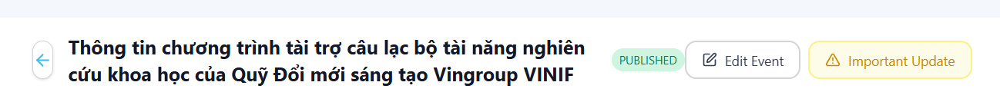 | 2026-07-30 |
| BUG-ScreenA4-1.11 | ScreenA4 | Bug | The status filter button group (Rejected / Pending Review / Approved) in the Review Students/Lecturers tab is visually inconsistent: (1) only "× Rejected" carries a symbol prefix in its label while the other two buttons do not; (2) the active-state text colour is white on red/green for "Rejected"/"Approved" but dark text on yellow for "Pending Review", creating an inconsistent contrast treatment across same-type buttons. | 1. Login as admin. 2. Navigate to Events Management. 3. Click the view icon on any event. 4. Go to the "Review Students" or "Review Lecturers" tab. 5. Observe the Rejected / Pending Review / Approved filter button group — note the "×" prefix only on "Rejected" and the inconsistent text colour in active states. | Medium | Standardise label format across all filter buttons (remove or apply symbol prefixes consistently); ensure active-state text colour follows a unified rule (e.g. always white text on coloured backgrounds) across all three buttons (Nielsen #4: Consistency and Standards). | 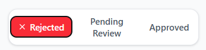 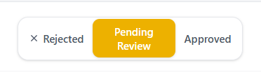 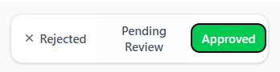 | 2026-07-30 |
| BUG-ScreenA1-1.15 | ScreenA1 | Usability | No tooltips or contextual help are provided for the filter funnel icons on the EVENT TYPES and TIME column headers, nor for the notification dot badge on the bell icon, leaving users without guidance on their function. | 1. Login as admin. 2. Navigate to Events Management. 3. Hover over the filter funnel icon next to "EVENT TYPES" or "TIME" column headers — no tooltip appears. 4. Hover over the notification dot badge on the bell icon in the ACTIONS column — no tooltip appears. | Low | Add `title` attributes or custom tooltip components to filter icons and notification badges (e.g. "Filter by event type", "Pending support requests"). | 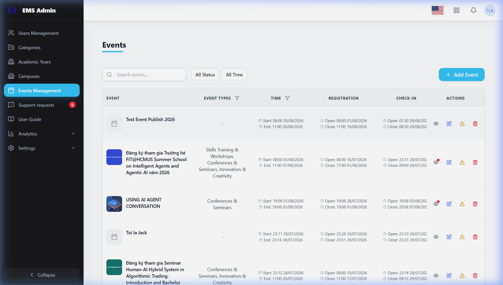 | 2026-07-30 |
| BUG-ScreenA1-3.05 | ScreenA1 | Usability | No "Back to top" button is visible on the Events Management page when scrolling down through a long list of events. | 1. Login as admin. 2. Navigate to Events Management. 3. Scroll down the events list past 5+ entries. 4. Observe — no "Back to top" button or floating anchor appears. | Low | Add a floating "Back to top" button that appears after the user scrolls down more than ~300 px, scrolling smoothly to the top of the page on click. | 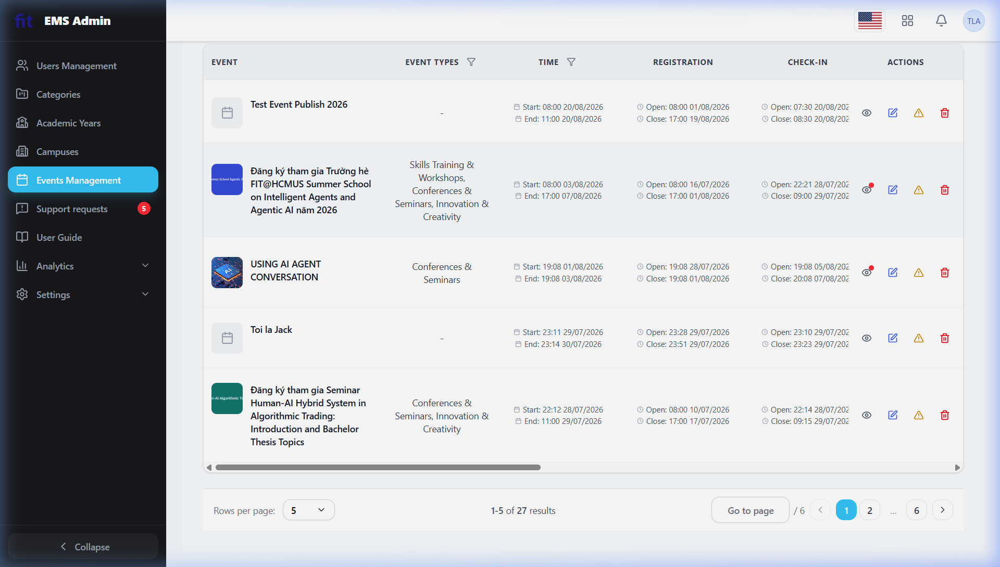 | 2026-07-30 |
| BUG-ScreenA1-3.09 | ScreenA1 | Usability | The search bar on the Events Management page has no visible clear (×) button to reset the search query. Users must manually select and delete text to clear the field. | 1. Login as admin. 2. Navigate to Events Management. 3. Type any text in the "Search events…" input. 4. Observe — no clear/reset button (×) appears inside the search field. | Low | Add a × (clear) button inside the search input that appears whenever the field contains text; clicking it clears the input and resets the event list. | 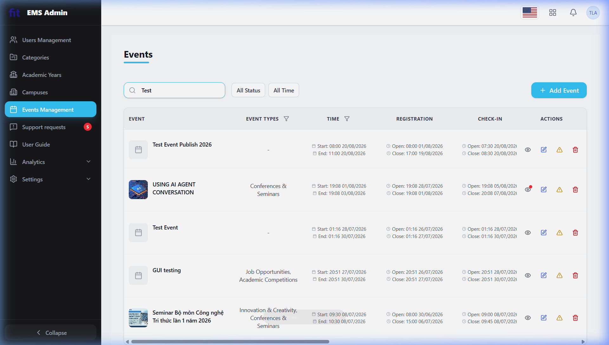 | 2026-07-30 |
| BUG-ScreenA3-2.06 | ScreenA3 | Bug | The "Max Slots" field in the Lecturer Roles and Student Roles sections does not enforce or display any min/max constraint. Entering 0 or 999999 causes no inline validation error. | 1. Login as admin. 2. Click Events Management → "+ Add Event". 3. Scroll to the Lecturer Roles section. 4. Enter "0" or "999999" in the Max Slots field. 5. Observe — no validation error appears. | Medium | Add client-side validation with `min=1` and a reasonable maximum on the Max Slots input; show an inline error message below the field when limits are exceeded. | 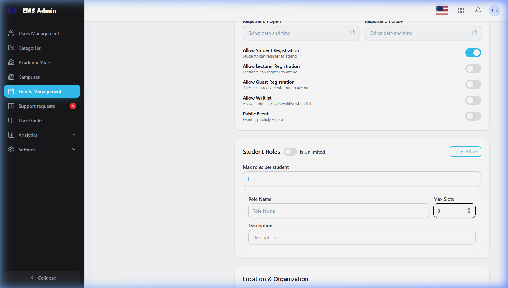 | 2026-07-30 |
| BUG-ScreenA3-2.15 | ScreenA3 | Usability | When Registration Open/Close date-time fields are left empty and the form is submitted, validation errors appear only as a global toast or top-level alert — not directly adjacent to the specific fields. | 1. Login as admin. 2. Click "+ Add Event". 3. Scroll to the Registration section. 4. Leave Registration Open and Registration Close fields empty. 5. Click Submit/Create. 6. Observe — validation message appears as a global toast, not inline next to the fields. | Medium | Display inline error messages directly below the Registration Open and Registration Close fields when they are empty or invalid, in addition to any global toast notification. | 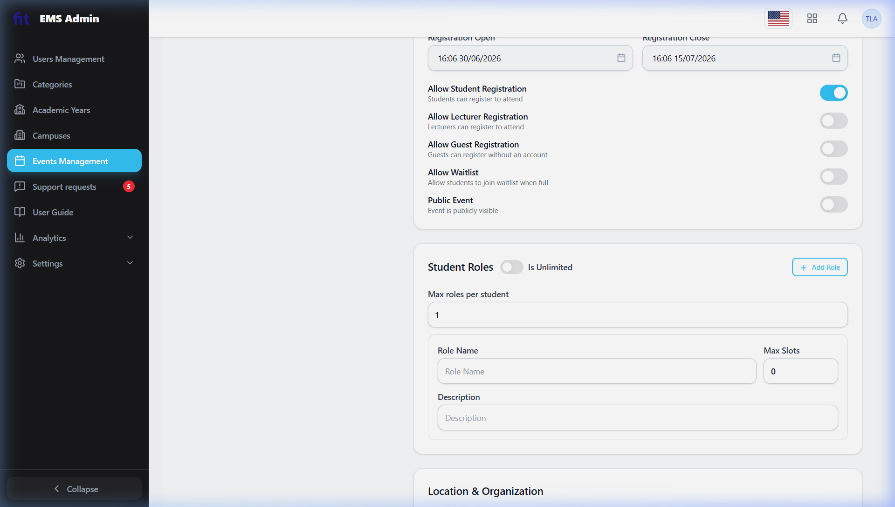 | 2026-07-30 |
| BUG-ScreenA3-3.03 | ScreenA3 | Usability | No breadcrumb navigation is visible on the Create/Edit Event page. The only way to navigate back is via the browser Back button or the sidebar — users cannot see their location in the navigation hierarchy. | 1. Login as admin. 2. Click Events Management → "+ Add Event". 3. Observe the top of the page — no breadcrumb trail is displayed. | Low | Add a breadcrumb component at the top of the Create/Edit Event page (e.g. Events Management > Create New Event) with clickable links to parent pages. | 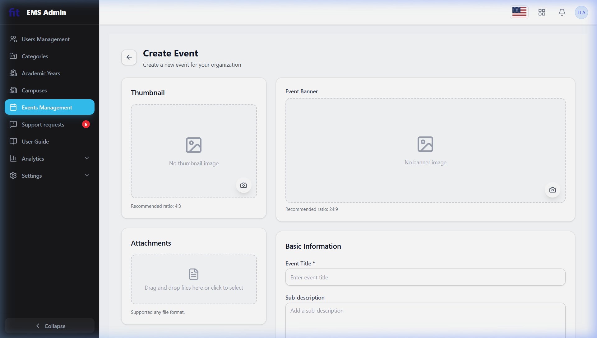 | 2026-07-30 |
| BUG-ScreenA4-4.06 | ScreenA4 | Usability | The "Add note…" inline input in the NOTE column provides no character counter, format hint, or limit guidance. No error is shown if the note exceeds any server-side limit. | 1. Login as admin. 2. Navigate to Events Management. 3. Click the view icon on any event. 4. Click the "Review Students" tab. 5. Click "Add note…" for any student — observe the lack of guidance. | Low | Add a character counter and a brief placeholder hint to the note field (e.g. "Add rejection reason or note (max 200 chars)"). Show an inline error if content exceeds the limit. | 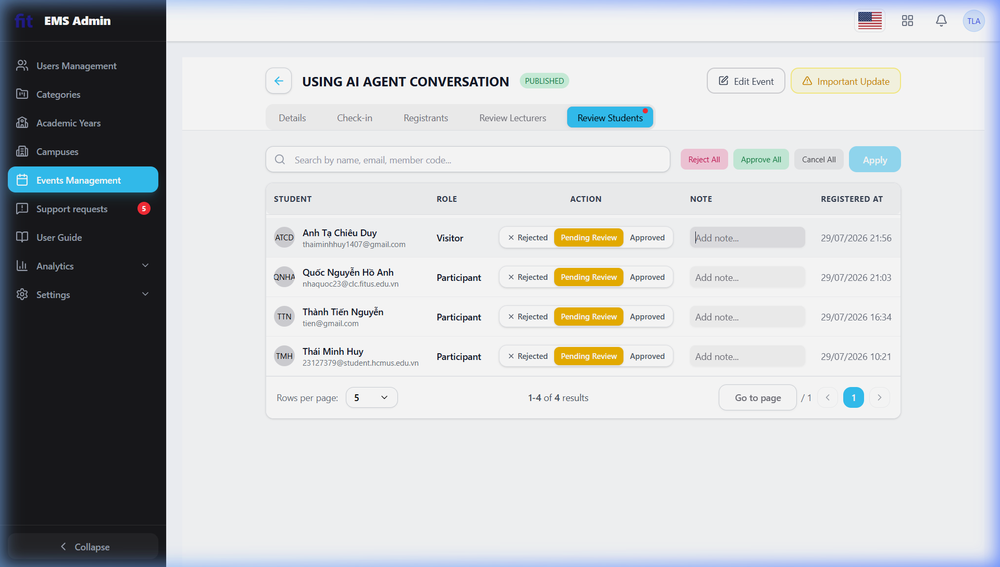 | 2026-07-30 |
| BUG-ScreenA4-4.12 | ScreenA4 | Bug | The selected-filter count in the "Apply (1)" button is rendered as plain inline text in parentheses rather than a proper circular badge or pill component, making it visually ambiguous and inconsistent with standard badge UI conventions. | 1. Login as admin. 2. Navigate to Events Management. 3. Click the view icon on any event. 4. Go to the "Review Lecturers" or "Review Students" tab. 5. Observe the "Apply (1)" button — the "(1)" counter uses parentheses instead of a dedicated badge/pill element. | Low | Replace the inline `(1)` counter with a properly styled circular badge or pill component (e.g. a `` with `background`, `border-radius: 50%`, fixed dimensions) positioned with `margin-left: 6px` to the right of the label. |  | 2026-07-30 |
| BUG-ScreenA4-4.13 | ScreenA4 | Usability | The "Rejected" status in the ACTION column is displayed as plain dark/gray text (e.g. "× Rejected"), lacking a distinct red background badge. This is inconsistent with "Pending Review" (orange pill) and "Approved" (green), breaking the colour-coding convention. | 1. Login as admin. 2. Navigate to an event's Review Students tab. 3. Observe the ACTION column — "Pending Review" has an orange pill badge and "Approved" is shown in green, but "Rejected" is styled inconsistently without a red background pill. | Medium | Apply a consistent red background pill badge (e.g. `bg-red-100 text-red-700`) to the "Rejected" status indicator, matching the pill-badge pattern used for other statuses. | 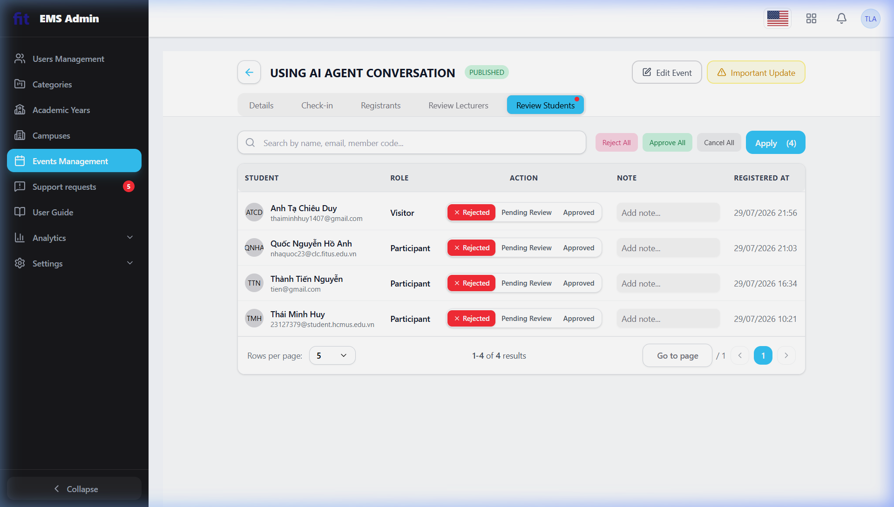 | 2026-07-30 |
| BUG-ScreenA4-4.15 | ScreenA4 | Usability | After clicking "Reject All" or individually rejecting a student, there is no "Undo" option available. These actions are logically reversible and should offer a short-window undo per Shneiderman's principle of easy reversal of actions. | 1. Login as admin. 2. Navigate to the Review Students tab on any event. 3. Click "Reject All" and confirm. 4. Observe — no toast with an "Undo" option appears after the action completes. | Medium | After a bulk or individual rejection, show a dismissible toast with an "Undo" action available for 5–10 seconds that reverts the status change before it is permanently committed. | 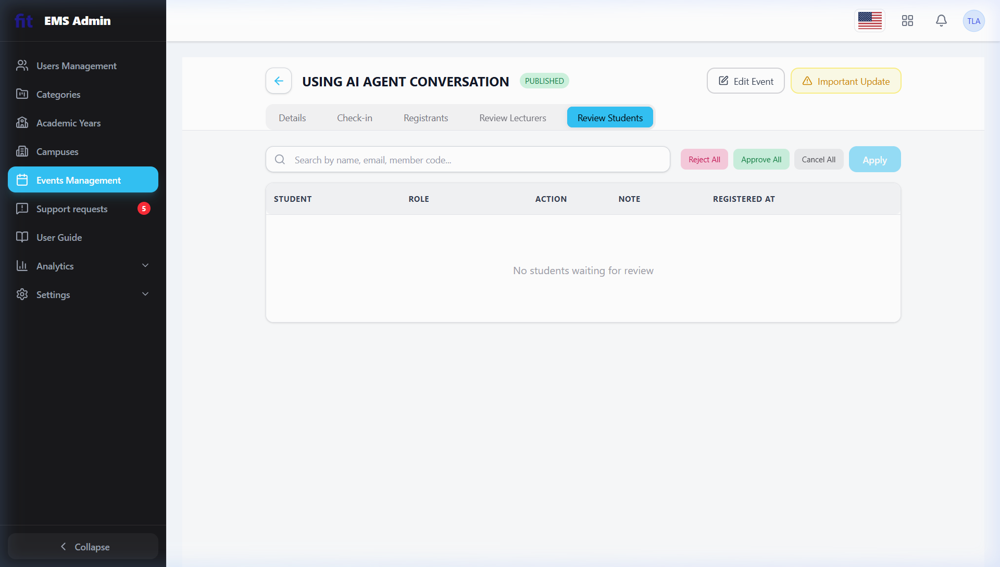 | 2026-07-30 |
| BUG-ScreenA4-3.05 | ScreenA4 | Usability | No "Back to top" button is visible on the Event Detail page (Review Students / Lecturers tabs) when scrolling down through a long student list. This is the same system-wide omission as BUG-ScreenA1-3.05. | 1. Login as admin. 2. Navigate to Events Management. 3. Click the view icon on any event with many registrants. 4. Go to the "Review Students" or "Review Lecturers" tab. 5. Scroll down the student list. 6. Observe — no "Back to top" button appears. | Low | Add a floating "Back to top" button that appears after scrolling down more than ~300 px and scrolls the page smoothly to the top on click. Apply the fix globally across all long-scrolling pages. | — | 2026-07-30 |
| BUG-ScreenA4-3.09 | ScreenA4 | Usability | The search box in the Review Students / Lecturers tab has no clear (×) button to reset the query. As shown in the screenshot with text "LOLoahdohadoj", users must manually select and delete text to clear the field, mirroring the same defect as BUG-ScreenA1-3.09. | 1. Login as admin. 2. Navigate to Events Management. 3. Click the view icon on any event. 4. Go to the "Review Students" tab. 5. Type any text in the search box. 6. Observe — no clear (×) button appears inside or adjacent to the search field. | Low | Add a × (clear) button inside the search input that appears whenever the field is non-empty; clicking it clears the input and resets the student list. Apply consistently to all search inputs system-wide. | 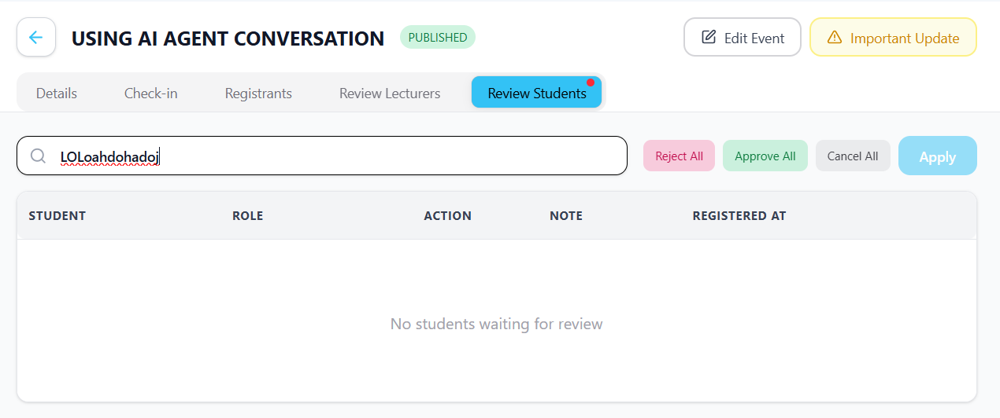 | 2026-07-30 |
| BUG-ScreenA3-2.02 | ScreenA3 | Bug | The "+ Add Role" button in the Lecturer Roles and Student Roles sections can be clicked repeatedly while previously created panels still have required fields (Role Name, Max Slots) left empty. This allows users to generate multiple blank/incomplete role panels simultaneously, creating noisy data and making it easy to overlook unfilled mandatory fields before submitting. | 1. Login as admin. 2. Click Events Management → "+ Add Event". 3. Scroll to the Lecturer Roles or Student Roles section. 4. Click "+ Add Role" to create the first panel but leave Role Name and Max Slots blank. 5. Click "+ Add Role" again — a second empty panel is created without any warning. | Medium | Disable the "+ Add Role" button (or show an inline warning) whenever any existing role panel has incomplete required fields. Only re-enable once all current panels are valid. This enforces progressive disclosure and prevents accumulation of empty records. | 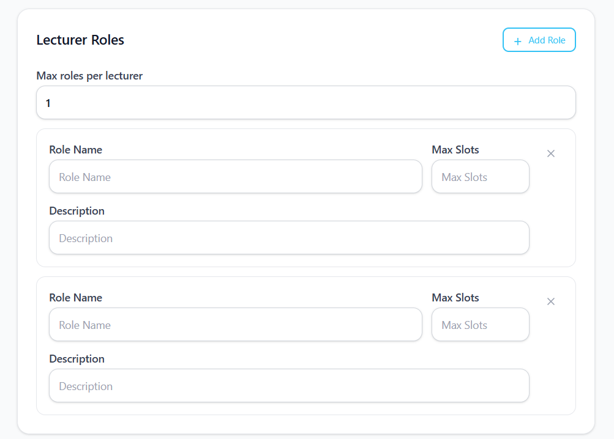 | 2026-07-30 |
| BUG-ScreenA3-2.05 | ScreenA3 | Bug | The "Max Slots" field in Lecturer / Student role panels is inconsistent with the "Max roles per lecturer" field directly above it: the top field immediately shows a red "Please enter a number" error when letters are typed, but the Max Slots fields below accept arbitrary non-numeric strings (including long alphanumeric pastes and emoji) via clipboard paste without any inline error or character restriction. | 1. Login as admin. 2. Click "+ Add Event" and scroll to Lecturer Roles. 3. Click "+ Add Role" to open a role panel. 4. In the Max Slots field, paste a string such as "271-e101111111…" or an emoji sequence. 5. Observe — no inline error appears and the invalid value is accepted in the field. Compare with the "Max roles per lecturer" field which blocks non-numeric input immediately. | Medium | Enforce `type="number"` (or an `inputmode="numeric"` with a JS keypress filter) on the Max Slots input; strip non-numeric characters on paste and show an inline error identical to the one on the "Max roles per lecturer" field. Apply consistently to all numeric role fields. | 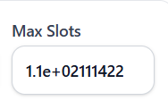 | 2026-07-30 |
| BUG-ScreenA3-2.06B | ScreenA3 | Bug | The "Role Name" text field in Lecturer / Student role panels performs no real-time length validation. A user can paste a string exceeding 255 characters and the field remains visually green (valid). The error "Role name must be at most 255 characters" is deferred until the "Publish" button is clicked, wasting user effort and violating the principle of immediate inline feedback. | 1. Login as admin. 2. Click "+ Add Event" → Lecturer Roles → "+ Add Role". 3. In the Role Name field, paste a string longer than 255 characters. 4. Observe — no inline error appears and the field border does not turn red. 5. Click Publish — only then does the error appear. | Medium | Add `maxlength="255"` on the Role Name input and/or a real-time character counter; trigger the inline error immediately on blur (or on input) when the 255-character limit is exceeded, without waiting for form submission. | 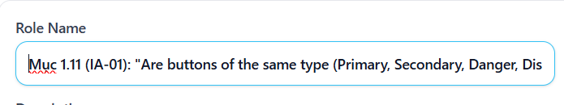 | 2026-07-30 |
| BUG-ScreenA3-2.06C | ScreenA3 | Bug | The "Description" textarea (event description field on the Create/Edit Event page) imposes no visible character limit and allows pasting up to 100,000+ characters, which can be Published successfully. This risks layout overflow on the event detail display page and potential database truncation or payload overflow errors if the underlying DB column (e.g. VARCHAR or limited TEXT type) has a server-side constraint. | 1. Login as admin. 2. Click "+ Add Event". 3. In the Description field, paste a text block of ≥ 100,000 characters. 4. Click Publish — the event is created without any error. 5. Navigate to the event detail page and observe potential layout breaking or truncation. | High | Add a `maxlength` attribute or a JavaScript character counter (e.g. "500 / 2000 characters") to the Description field; display an inline warning when the limit is approached and block submission when it is exceeded. Align the client-side limit with the server-side DB column constraint. | 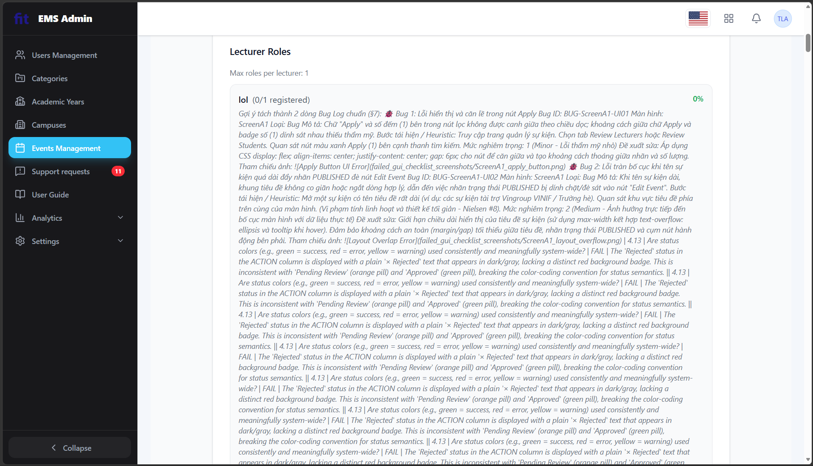 | 2026-07-30 |
